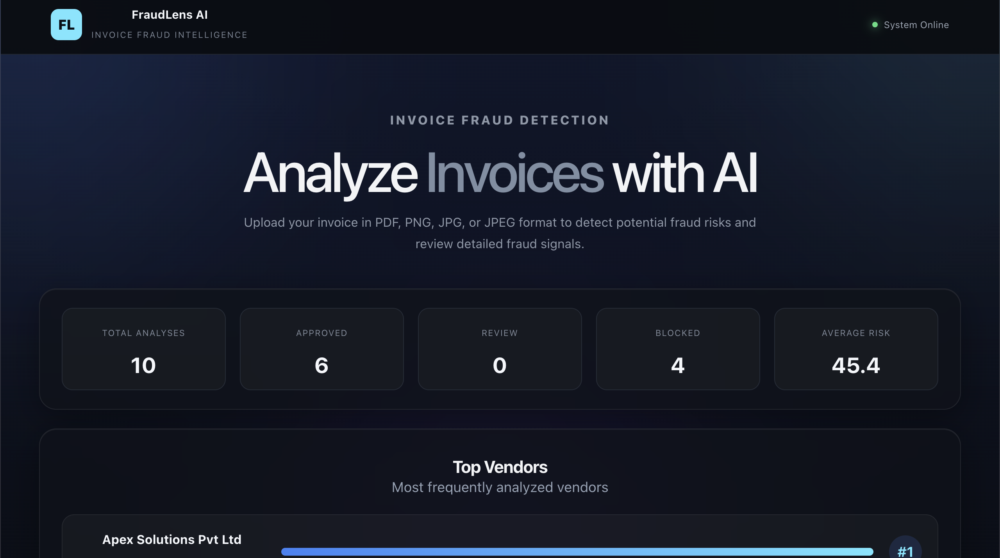
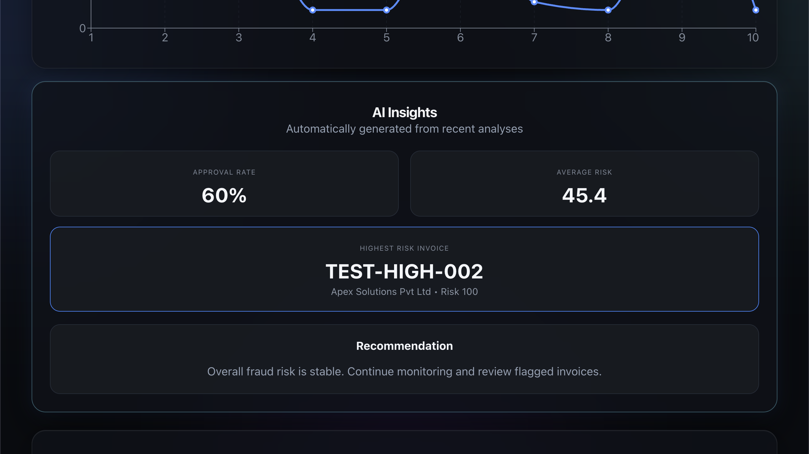
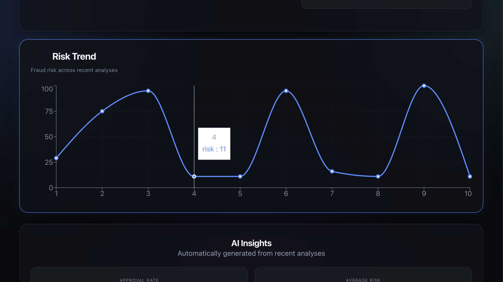
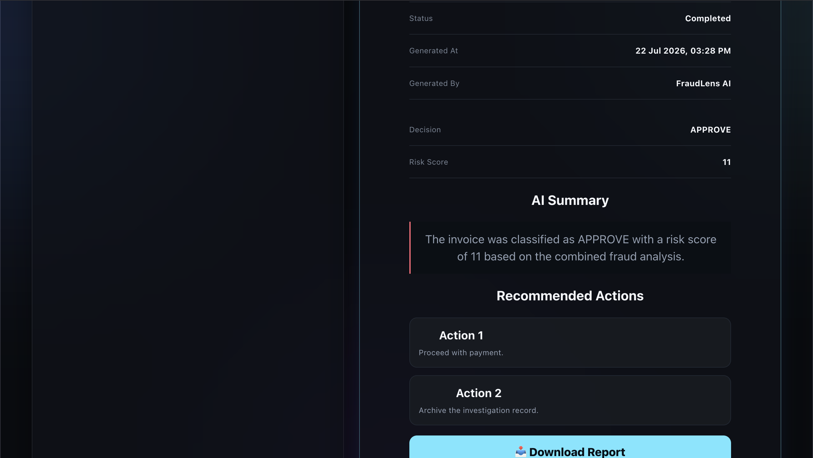
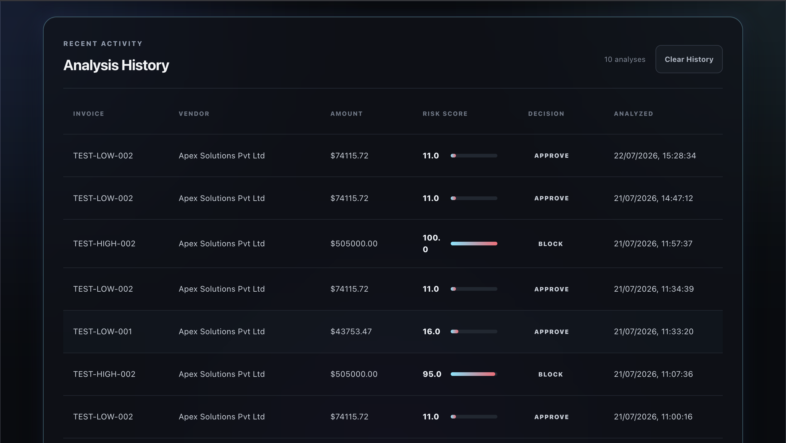
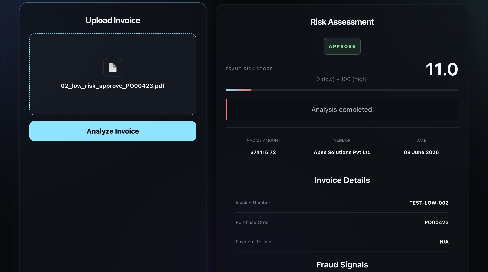

# FraudLens AI – Intelligent Invoice Fraud Detection Platform

FraudLens AI is an AI-powered invoice fraud detection platform that analyzes invoices using Google Gemini, rule-based fraud detection, and Machine Learning (Isolation Forest) to identify suspicious financial transactions. The platform generates explainable fraud signals, investigation reports, and downloadable PDF reports through an interactive analytics dashboard.

---

## Features

- AI-powered invoice extraction using Google Gemini
- Rule-based fraud detection engine
- Isolation Forest anomaly detection
- Explainable fraud signals with severity levels
- Fraud risk scoring (0–100)
- AI-generated Fraud Investigation Report
- PDF Investigation Report download
- Interactive analytics dashboard
- Vendor insights and fraud trends
- Recent high-risk alerts
- Analysis history

---

# Dashboard

FraudLens AI provides an interactive dashboard that enables finance teams to monitor invoice investigations, fraud trends, vendor activity, and overall risk metrics.

## Dashboard Overview

Displays overall analytics including Total Analyses, Approval Rate, Review Count, Blocked Invoices, Average Risk Score, and Top Vendors.



---

## Dashboard Analytics

Provides visual insights into fraud distribution across invoice decisions.



---

## Risk Trend

Displays fraud risk scores across recent invoice analyses, helping identify abnormal spikes and fraud patterns.



---

## AI Insights

Provides automatically generated business insights including approval rate, average fraud score, highest-risk invoice, recommendations, and recent fraud alerts.



---

## Analysis History

Maintains a history of previous invoice investigations for quick review.



---

## Invoice Upload

Users can upload invoices in PDF, PNG, JPG, or JPEG format for AI-powered fraud analysis.



---

# Fraud Analysis

Displays the fraud decision, fraud risk score, invoice information, and explainable fraud signals generated by the AI engine.


---

# Investigation Report

Generates a professional investigation report containing the Case ID, AI-generated summary, fraud decision, and recommended actions.


---

# PDF Investigation Report

Allows users to export the complete investigation report as a professional PDF for auditing and compliance.


---

# System Architecture

```text
                Invoice Upload
                      │
                      ▼
         Google Gemini Extraction
                      │
                      ▼
          Extracted Invoice Details
                      │
        ┌─────────────┴─────────────┐
        ▼                           ▼
 Rule-Based Fraud Engine      Isolation Forest
        │                           │
        └─────────────┬─────────────┘
                      ▼
              Decision Fusion Engine
                      ▼
           Explainability Engine
                      ▼
        Fraud Investigation Report
                      ▼
     Dashboard & PDF Investigation Report
```

---

# Technology Stack

## Frontend

- React.js
- JavaScript
- CSS
- Chart.js
- jsPDF

## Backend

- FastAPI
- Python
- REST APIs
- Google Gemini API

## Machine Learning

- Scikit-learn
- Isolation Forest
- Pandas
- NumPy

---

# Project Structure

```text
FraudLens-AI
│
├── backend/
│   ├── app/
│   │   ├── ml/
│   │   ├── analysis_pipeline.py
│   │   ├── decision_fusion.py
│   │   ├── explanation_engine.py
│   │   ├── risk_engine.py
│   │   └── main.py
│
├── frontend/
│
├── data/
│
├── test_invoices/
│
├── Screenshots/
│
├── README.md
│
└── .gitignore
```

---

# Workflow

```text
Invoice Upload
        │
        ▼
Google Gemini Extraction
        │
        ▼
Rule-Based Fraud Detection
        │
        ▼
Isolation Forest
        │
        ▼
Decision Fusion
        │
        ▼
Fraud Investigation Report
        │
        ▼
Dashboard & PDF Export
```

---

# Installation

## Clone Repository

```bash
git clone https://github.com/YOUR_USERNAME/FraudLens-AI.git

cd FraudLens-AI
```

---

## Backend

```bash
python -m venv venv

source venv/bin/activate

pip install -r requirements.txt

uvicorn backend.app.main:app --reload
```

Backend:

```
http://127.0.0.1:8000
```

---

## Frontend

```bash
cd frontend

npm install

npm run dev
```

Frontend:

```
http://localhost:5173
```

---

# Future Improvements

- PostgreSQL integration
- Authentication & Role-Based Access
- RAG-powered fraud policy assistant
- Batch invoice analysis
- Multi-agent investigation workflow
- Cloud deployment

---

# Highlights

- AI-powered invoice extraction using Google Gemini
- Hybrid fraud detection using Rules + Machine Learning
- Isolation Forest anomaly detection
- Explainable AI with fraud signal generation
- Interactive analytics dashboard
- Automated Fraud Investigation Report
- One-click PDF report export
- Modular FastAPI backend architecture

---

# Author

**Shaik Mohammad Masood**

GitHub: https://github.com/masood-shk

LinkedIn: https://linkedin.com/in/masoodshaik23

---

# License

This project is licensed under the MIT License.